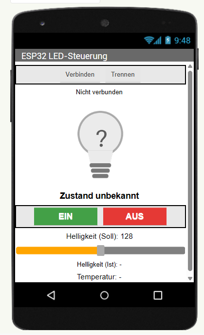
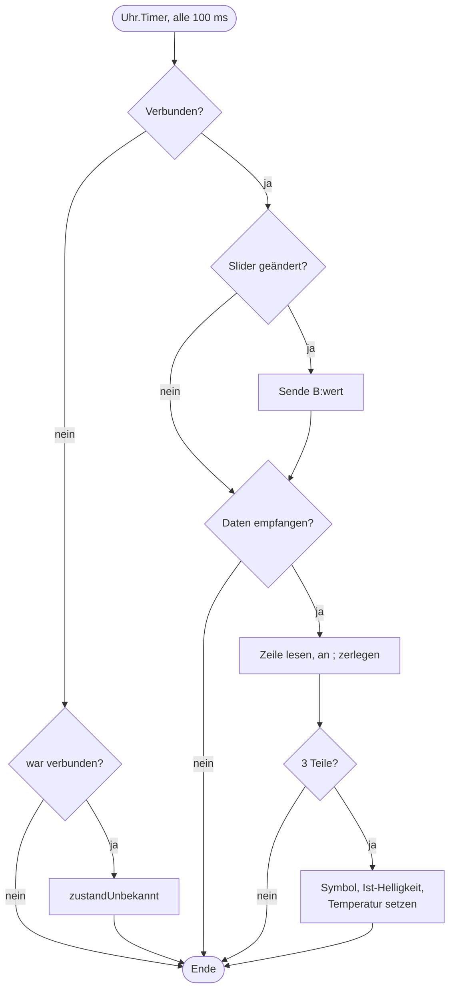

# ESP32 LED-Steuerung per Bluetooth

Android-App mit **MIT App Inventor**, die über **Bluetooth Classic (SPP)** eine LED an einem **ESP32** ein- und ausschaltet und ihre Helligkeit per Slider einstellt. Die App zeigt den **tatsächlichen Zustand** des ESP32-Ausgangs als Lampen-Symbol an und gibt zusätzlich einen Temperaturwert aus.

<p align="center">
  
</p>

---

## Inhalt

- [Funktionen](#funktionen)
- [Projektstruktur](#projektstruktur)
- [Voraussetzungen](#voraussetzungen)
- [Hardware und Verdrahtung](#hardware-und-verdrahtung)
- [Installation](#installation)
- [Bedienung](#bedienung)
- [Lampen-Symbol: echter Zustand statt Annahme](#lampen-symbol-echter-zustand-statt-annahme)
- [Kommunikationsprotokoll](#kommunikationsprotokoll)
- [Programmablauf](#programmablauf)
- [Aufbau der App (Designer)](#aufbau-der-app-designer)
- [Logik der App (Blocks)](#logik-der-app-blocks)
- [ESP32-Sketch](#esp32-sketch)
- [Fehlersuche](#fehlersuche)
- [Erweiterungsideen](#erweiterungsideen)
- [Autor](#autor)

---

## Funktionen

- Verbindung zu einem gekoppelten ESP32 über Bluetooth Classic
- LED **EIN / AUS** schalten
- **Helligkeit 0–255** per Slider vorgeben (PWM am ESP32)
- **Lampen-Symbol** zeigt den vom ESP32 zurückgemeldeten Ausgangszustand
- Anzeige von **Soll- und Ist-Helligkeit**
- Anzeige der **Temperatur** (vorerst interner Chip-Sensor)
- Erkennt einen Verbindungsabbruch und zeigt dann „Zustand unbekannt“

## Projektstruktur

```
├── app/
│   └── LedSteuerung.aia          App-Inventor-Projekt (importierbar)
├── esp32/
│   └── ESP32_LED_BT/
│       └── ESP32_LED_BT.ino      Arduino-Sketch für den ESP32
├── docs/
│   ├── screenshot_app.png        Screenshot der App
│   ├── lampe_an.png              Symbol: Ausgang aktiv
│   ├── lampe_aus.png             Symbol: Ausgang aus
│   └── lampe_unbekannt.png       Symbol: keine Verbindung
└── README.md
```

## Voraussetzungen

| Bereich | Anforderung |
|---|---|
| App-Entwicklung | MIT App Inventor (online oder lokaler Server) |
| Smartphone | Android mit Bluetooth. **Der Emulator hat kein Bluetooth**, zum Testen ist ein echtes Gerät nötig (AI2 Companion oder installierte APK). |
| Mikrocontroller | **Klassischer ESP32** (z. B. ESP32-DevKitC, WROOM-32). **ESP32-S3 und ESP32-C3 werden nicht unterstützt**, da sie kein Bluetooth Classic besitzen, nur BLE. |
| Arduino IDE | Board-Paket **esp32 by Espressif ab Version 3.x** |
| LED | Onboard-LED an GPIO 2 oder externe LED mit Vorwiderstand |

## Hardware und Verdrahtung

Viele ESP32-DevKits haben bereits eine LED an **GPIO 2**, dann ist keine Verdrahtung nötig. Für eine externe LED:

```
ESP32 GPIO 2 ──── 220 Ω ────►|──── GND
                            LED
                     (Anode)  (Kathode)
```

Der Pin kann im Sketch über `LED_PIN` geändert werden.

## Installation

### 1. ESP32 programmieren

1. `esp32/ESP32_LED_BT/ESP32_LED_BT.ino` in der Arduino IDE öffnen.
2. Board wählen, z. B. **ESP32 Dev Module**.
3. Hochladen. Im seriellen Monitor (115200 Baud) erscheint:
   ```
   Bluetooth gestartet als "ESP32-LED"
   ```

### 2. ESP32 mit dem Handy koppeln

In den **Android-Bluetooth-Einstellungen** nach Geräten suchen und **ESP32-LED** koppeln. Die App listet nur bereits gekoppelte Geräte auf.

### 3. App installieren

1. In App Inventor: **Projects → Import project (.aia) from my computer** → `app/LedSteuerung.aia`.
2. Auf das Handy bringen, entweder
   - **Connect → AI Companion** (Handy und PC im selben WLAN), oder
   - **Build → Android App (.apk)** und die APK installieren.
3. Beim ersten Start die Bluetooth-Berechtigungen erlauben (ab Android 12 erforderlich).

## Bedienung

1. **Verbinden** antippen und den ESP32 aus der Liste wählen.
2. Die Statuszeile zeigt „Verbunden: …“. Die App fragt sofort den aktuellen Zustand ab.
3. **EIN** / **AUS** schaltet die LED.
4. Mit dem **Slider** die Helligkeit einstellen. Die Änderung wirkt auch bei ausgeschalteter LED und gilt beim nächsten Einschalten.
5. **Trennen** beendet die Verbindung.

## Lampen-Symbol: echter Zustand statt Annahme

Die App schaltet das Symbol **nie selbst** um. Ein Tipp auf EIN sendet nur den Befehl `ON`. Das Symbol wechselt erst, wenn der ESP32 den Zustand zurückmeldet. Dazu liest er den PWM-Tastgrad mit `ledcRead()` direkt aus der Hardware.

| Symbol | Bedeutung |
|:---:|---|
|  | Ausgang aktiv (Tastgrad > 0) |
|  | Ausgang aus, auch bei „EIN“ mit Helligkeit 0 |
|  | Keine Verbindung, Zustand unbekannt |

So sieht man sofort, ob ein Befehl wirklich angekommen ist.

## Kommunikationsprotokoll

Einfache Textzeilen, jede Zeile endet mit `\n` (Byte 10).

### App → ESP32

| Befehl | Bedeutung |
|---|---|
| `ON` | LED einschalten |
| `OFF` | LED ausschalten |
| `B:<0..255>` | Helligkeit setzen, z. B. `B:200` |
| `?` | Nur Status anfordern |

### ESP32 → App

Format: `S;B;T`

| Feld | Bedeutung | Beispiel |
|---|---|---|
| `S` | Tatsächlicher Ausgang: `1` = aktiv, `0` = aus | `1` |
| `B` | Eingestellte Helligkeit 0–255 | `128` |
| `T` | Temperatur in °C (eine Nachkommastelle) | `41.5` |

Beispiel: `1;128;41.5`

Der ESP32 sendet den Status **nach jedem Befehl** und zusätzlich **jede Sekunde**, solange ein Handy verbunden ist. Unbekannte Befehle werden ignoriert und im seriellen Monitor gemeldet.

## Programmablauf

```mermaid
sequenceDiagram
    participant U as Benutzer
    participant A as App (Android)
    participant E as ESP32

    U->>A: Verbinden, Gerät wählen
    A->>E: Bluetooth-Verbindung (SPP)
    A->>E: ?
    E-->>A: 0;128;41.5
    A->>A: Symbol "aus"

    U->>A: Tippt EIN
    A->>E: ON
    E->>E: ledcWrite(128)
    E->>E: ledcRead() > 0
    E-->>A: 1;128;41.6
    A->>A: Symbol "an"

    U->>A: Slider auf 200
    A->>E: B:200
    E-->>A: 1;200;41.6

    loop jede Sekunde
        E-->>A: S;B;T
    end
```

### App: Timer als Spielschleife

App Inventor ist ereignisgesteuert. Die zyklische Arbeit übernimmt eine Clock mit 100 ms Intervall:



## Aufbau der App (Designer)

| Komponente | Typ | Wichtige Eigenschaften | Zweck |
|---|---|---|---|
| `LpVerbinden` | ListPicker | Text „Verbinden“ | Gerät auswählen |
| `BtnTrennen` | Button | | Verbindung trennen |
| `LblVerbindung` | Label | | Verbindungsstatus |
| `ImgLampe` | Image | 160 × 160, ScalePictureToFit | Lampen-Symbol |
| `LblZustand` | Label | fett | „LED ist EIN / AUS“ |
| `BtnEin` / `BtnAus` | Button | grün / rot | Schalten |
| `LblHelligkeit` | Label | | Soll-Helligkeit |
| `SldHelligkeit` | Slider | Min 0, Max 255, Start 128 | Helligkeit vorgeben |
| `LblIst` | Label | | Ist-Helligkeit vom ESP32 |
| `LblTemperatur` | Label | | Temperatur vom ESP32 |
| `BT` | BluetoothClient | **DelimiterByte = 10** | Kommunikation |
| `Uhr` | Clock | TimerInterval 100 | Senden und Empfangen |

`DelimiterByte = 10` ist wichtig: Damit liefert `ReceiveText(-1)` genau eine Zeile bis zum Zeilenende.

## Logik der App (Blocks)

**Globale Variablen**

| Variable | Bedeutung |
|---|---|
| `verbunden` | Merkt sich, ob eine Verbindung bestand. Damit wird ein Abbruch erkannt. |
| `sendeHelligkeit` | Wird vom Slider gesetzt und vom Timer abgearbeitet. |
| `zeile` | Zuletzt empfangene Statuszeile. |
| `teile` | Die Statuszeile, zerlegt in eine Liste. |

**Ereignisse**

- **`Screen1.Initialize`** fragt die Berechtigungen `BLUETOOTH_CONNECT` und `BLUETOOTH_SCAN` an und setzt die Anzeige auf „unbekannt“.
- **`LpVerbinden.BeforePicking`** füllt die Liste mit `BT.AddressesAndNames` (gekoppelte Geräte).
- **`LpVerbinden.AfterPicking`** verbindet mit dem gewählten Gerät und sendet bei Erfolg `?`.
- **`BtnEin.Click` / `BtnAus.Click`** senden `ON` bzw. `OFF`, sofern verbunden.
- **`SldHelligkeit.PositionChanged`** aktualisiert nur die Soll-Anzeige und setzt `sendeHelligkeit`. Gesendet wird im Timer. So wird der Slider auf höchstens 10 Befehle pro Sekunde gebremst und der ESP32 nicht überflutet.
- **`BtnTrennen.Click`** trennt die Verbindung und ruft `zustandUnbekannt` auf.
- **`Uhr.Timer`** siehe Ablaufplan oben.

**Prozedur `zustandUnbekannt`** setzt `verbunden` auf falsch, zeigt das Fragezeichen-Symbol und leert Ist-Helligkeit und Temperatur.

## ESP32-Sketch

| Konstante | Standard | Bedeutung |
|---|---|---|
| `GERAETENAME` | `ESP32-LED` | Bluetooth-Name |
| `LED_PIN` | `2` | Ausgangspin |
| `PWM_FREQUENZ` | `5000` | PWM-Frequenz in Hz |
| `PWM_AUFLOESUNG` | `8` | 8 Bit → Werte 0–255 |

**Funktionen**

| Funktion | Aufgabe |
|---|---|
| `ausgangSetzen()` | Schreibt `helligkeit` oder `0` auf den PWM-Ausgang. |
| `statusSenden()` | Liest den echten Tastgrad mit `ledcRead()` und sendet `S;B;T`. |
| `befehlAusfuehren()` | Wertet einen Befehl aus, setzt den Ausgang und antwortet mit dem Status. |
| `loop()` | Sammelt Zeichen bis `\n`, schützt vor zu langen Zeilen und sendet jede Sekunde den Status. |

**Temperatur:** `temperatureRead()` liest den internen Chip-Sensor. Der Wert ist ungenau und liegt meist deutlich über der Raumtemperatur. Für echte Messwerte `temperatureRead()` in `statusSenden()` durch einen externen Sensor ersetzen (z. B. DS18B20 oder DHT22). Das Protokoll bleibt gleich.

**Hinweis zum Board-Paket:** Der Sketch nutzt die API ab Arduino-ESP32 **3.x** (`ledcAttach(pin, freq, res)`, `ledcWrite(pin, …)`). Bei Version 2.x stattdessen `ledcSetup()` und `ledcAttachPin()` mit Kanalnummer verwenden oder das Board-Paket aktualisieren.

## Fehlersuche

| Problem | Ursache und Lösung |
|---|---|
| Liste beim Verbinden ist leer | ESP32 zuerst in den Android-Einstellungen koppeln. Bluetooth am Handy einschalten. |
| „Verbindung fehlgeschlagen“ | ESP32 läuft nicht oder ist bereits mit einem anderen Gerät verbunden. ESP32 neu starten. |
| Fehlermeldung zu Berechtigungen | In den Android-App-Einstellungen „Geräte in der Nähe“ erlauben. |
| Im Emulator passiert nichts | Der Emulator hat kein Bluetooth. Echtes Gerät verwenden. |
| Kompilierfehler „Klassisches Bluetooth ist für dieses Board nicht verfügbar“ | Board ist ein ESP32-S3/C3. Klassischen ESP32 verwenden oder auf BLE umbauen. |
| Kompilierfehler bei `ledcAttach` | Board-Paket ist älter als 3.x, siehe Hinweis oben. |
| Symbol bleibt bei „EIN“ grau | Helligkeit steht auf 0. Slider hochziehen. |
| Temperatur wirkt zu hoch | Normal beim internen Sensor, siehe Abschnitt ESP32-Sketch. |

## Erweiterungsideen

- Echter Temperatursensor (DS18B20, DHT22) und weitere Messwerte als zusätzliche Felder im Protokoll
- Mehrere Ausgänge (z. B. `ON:2`, `B:2:128`)
- Slider beim Verbinden auf die Helligkeit des ESP32 synchronisieren
- BLE-Variante für ESP32-S3 / ESP32-C3
- Automatisches Wiederverbinden nach Abbruch

## Autor

**Ronny · RwTec**
